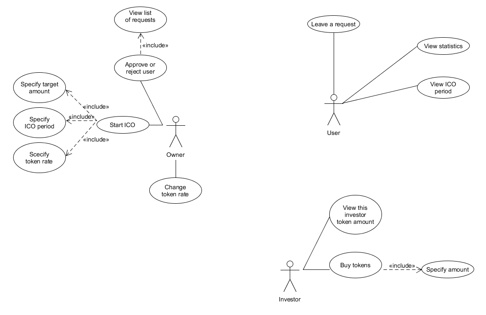

= Grain.io specifications
Author's Name <anna.light.terry@gmail.com>

:numbered:
== Common
=== Glossary
There are some terms, which we use though this document.
[glossary]
Initial coin offering (ICO)::
    attraction of investments by selling
    a fixed number of new units of crypto-currencies to investors

Know Your Client (KYC)::
    a policy in which financial institutions are required to establish
    the identity of their client before conducting transactions with him

=== Users and roles
- User – client, who didn't pass confirmation of identity yet
- Investor – client who passed the confirmation of identity; potential buyer of tokens
- Owner  – representative of the system owner

*Users* can view statistics to make sure, ICO proceeds successful. _It can attract new investors._

*Investors* can buy tokens to:
////////////////////////////
TODO What will investors get after ICO ending?
////////////////////////////
- profit in the future
- support the project evolution

*Owner* can start and end ICO.

== Business processes
In the Fig.1 you can see use cases of the system. More about it.

.Use case diagram

=== User's use cases
==== Leave a request
*Role:* User

*Period:* before ICO ends

*Description:* In accordance with KYC, user must confirm his identity before buying tokens. So, user can leave
a request to enter his address in the whitelist.
////////////////////////////
TODO What data should user provide to get the permission?
TODO How should ICO end?
////////////////////////////
==== View statistics
*Role:* User, Investor, Owner

*Period:* any

*Description:* There are several types of data, user can view:

 - current token rate
 - number of investors
 - ratio of the sold token amount to the common token amount

==== View ICO period
*Role:* User, Investor, Owner

*Period:* any

*Description:* User can view time limits of ICO, if they are established.
////////////////////////////
TODO Can owner cancel starting ICO, if contract is already deploed?
////////////////////////////

=== Owner's use cases
==== Approve or reject user
*Role:* Owner

*Period:* before ICO ends

*Description:* Owner can approve or reject a user request to enter the whitelist.

==== View list of requests
*Role:* Owner

*Period:* any

*Description:* Owner can view all requests, received from pretenders for whitelisting before
ICO ending.

==== Start ICO
*Role:* Owner

*Period:* before ICO starts

*Description:* Owner can start ICO or plan begin if it specifying following parameters:

- date of ICO begin (optional)
- date of ICO ending
- target amount in Ether
- token rate to Ether

Owner can do it using his favourite Ethereum client or WebSite

==== Change token rate
*Role:* Owner

*Period:* during ICO continue

*Description:* Owner can change the ratio of token to Ether.
Owner should specify following parameters:

- token rate to Ether

Owner can do it using his favourite Ethereum client or WebSite
==== Add progress stage
*Role:* Owner

*Period:* before ICO ends

*Description:* Owner can identify new ICO stage by specifying following parameters:

- the proportion of the target amount (percents)
- stage name

=== Investor's use cases
==== Buy tokens
*Role:* Investor

*Period:* during ICO continue

*Description:* Investor can get some tokens by transferring Ether to constant address.
Investor should specify following parameters:

- Ether amount, for which he wants to buy tokens

Investor can do it using his favourite Ethereum wallet or WebSite

==== View this investor token amount
*Role:* Investor

*Period:* any

*Description:* Investor can view how many tokens he already bought.

==== Receive notifications about ICO progress
*Role:* Investor

*Period:* during ICO continue

*Description:* Investor should get notifications about passing of the ICO stages. For example:
"Congratulations! We have collected already 7% of target amount. We plan to spend it to organize
 operational costs, besides the tech and marketing budgets."

 System should notify investors when collected amount achieves next ICO stage.